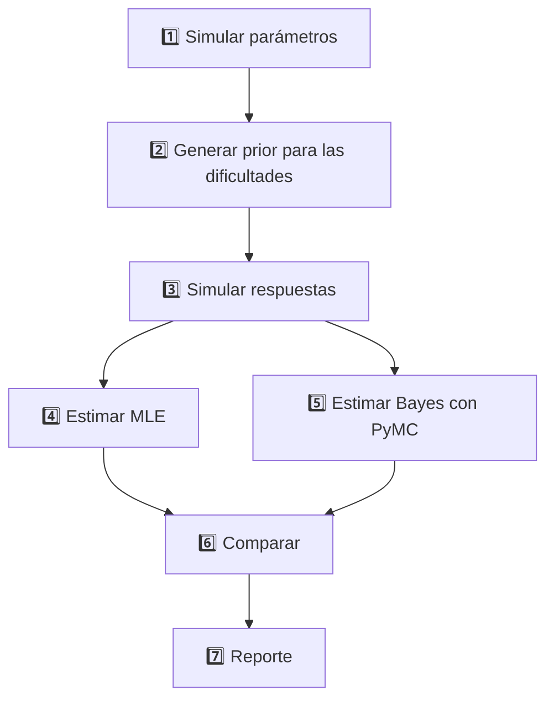

# Análisis de Calidad de Estimación 1PL: MLE vs. Bayesiano con Prior Informativo

## Resumen del Proyecto

Este proyecto evalúa empíricamente la efectividad de un **modelo bayesiano 1PL** que utiliza distribuciones *prior* para la dificultad del ítem basadas en **predicciones externas**, comparándolo con el método tradicional de **Máxima Verosimilitud (MLE)**. 

### Objetivo Principal

Determinar hasta qué punto un modelo bayesiano 1PL cuya distribución *prior* para la dificultad del ítem proviene de una predicción externa mejora la precisión de la estimación frente al método tradicional de MLE, considerando diferentes niveles de calidad del *prior* y tamaños muestrales.

### Factores Evaluados

*   **Calidad del *prior*** — tres valores de R²: `0.2`, `0.5`, `0.8`
*   **Tamaño de la sub‑muestra** — fracciones de las 1,000 personas: `0.3`, `0.5`, `0.8`, `1.0`

---

## Visualización del Pipeline


*Figura: Pipeline completo del análisis implementado en Kedro, mostrando el flujo desde la simulación de parámetros hasta la generación de reportes comparativos.*

## Metodología



---

## Resultados Preliminares

### Impacto del Tamaño Muestral en Estimación MLE

Los primeros resultados del experimento confirman el deterioro sistemático en la precisión de las estimaciones de máxima verosimilitud conforme se reduce el tamaño de la muestra:

#### Error Cuadrático Medio vs. Tamaño Muestral


*La figura muestra un incremento claro del error cuadrático medio (MSE) conforme disminuye el porcentaje de muestra utilizada en la estimación MLE.*

#### Coeficiente de Determinación vs. Tamaño Muestral  


*La capacidad predictiva del modelo MLE (R² entre parámetros verdaderos y estimados) disminuye notablemente con muestras reducidas.*

### Interpretación

Estos hallazgos establecen la **línea base** para evaluar si el enfoque bayesiano con *prior* informativo puede mitigar las limitaciones del MLE en condiciones de muestra reducida.

**Próximo análisis**: Comparación directa con resultados bayesianos y evaluación del impacto de la calidad del *prior* en diferentes escenarios muestrales.

---

## Estado del Proyecto

### ✅ Completado
- Implementación del pipeline de simulación con Kedro
- Módulo de estimación por máxima verosimilitud (MLE)  
- Generación de datos sintéticos y submuestreo
- Análisis preliminar de resultados MLE
- Visualización del pipeline con Kedro-Viz

### 🔄 En Desarrollo
- Implementación completa del modelo bayesiano con PyMC
- Análisis comparativo entre métodos MLE y Bayesiano
- Evaluación del impacto de la calidad del *prior*
- Generación de reportes estadísticos completos

### 📋 Planificado
- Análisis de sensibilidad de hiperparámetros
- Validación cruzada de resultados
- Redacción del manuscrito final

---

## GitHub Pages - Sitio Web del Proyecto

Este proyecto incluye un sitio web completo desplegado en GitHub Pages que presenta:

### 🌐 **[Ver Sitio Web](https://gabrielortegaproyectos.github.io/analisis-calidad-estimacion-1pl-bayesiana/)**

### 🧭 **[Ver Pipeline Interactivo (Kedro‑Viz)](https://gabrielortegaproyectos.github.io/analisis-calidad-estimacion-1pl-bayesiana/pipeline_visualization/index.html?pid=__default__&expandAllPipelines=false&types=parameters)**

#### Contenido del sitio:
- **Página Principal**: Descripción completa del experimento, metodología y tecnologías
- **Pipeline Interactivo**: Visualización en tiempo real del pipeline con Kedro-Viz
- **Resultados**: Métricas y análisis de comparación entre métodos MLE y Bayesiano

#### Características:
- ✨ Diseño académico profesional con estilo de revista científica
- 📊 Visualización interactiva del pipeline integrada
- 📱 Optimizado para dispositivos móviles
- 🚀 Despliegue automático con GitHub Actions
- 🔄 Actualización automática de visualizaciones cuando se modifica el pipeline

#### Configuración automática (versión ligera):
El workflow `pages.yml` ahora SOLO publica lo que ya exista dentro de `docs/` (no ejecuta Kedro ni instala dependencias). Por lo tanto:
1. Un push a `main` que cambie algo dentro de `docs/` despliega directamente.
2. No se reconstruye automáticamente la visualización del pipeline.


### Workflow opcional para ejecutar el pipeline
Sigue existiendo (o puedes mantener) un workflow separado (`kedro-pipeline.yml`) que corre el pipeline y guarda artefactos, pero ya NO interviene en el deploy de Pages.

---

## (Referencia histórica) Ejemplo de workflow de ejecución del pipeline

```yaml
name: Run Kedro Pipeline
on:
  push:
    branches: [ dev ]
    paths:
      - 'src/**'
      - 'conf/**'
      - 'pyproject.toml'
      - 'requirements.txt'
  pull_request:
    branches: [ main, dev ]
  workflow_dispatch:
```

---

## Métricas y reporte de resultados

### Fase 1 – JSON

*   Cada corrida genera `metrics_{r2}_{sample}.json` con:
    *   `rmse_mle`, `rmse_bayes`, `corr_mle`, `corr_bayes`, tiempos de cómputo…
*   Un nodo final agrega un resumen `latest_metrics.json` que puede ser mostrado en GitHub Pages.

---

## Tecnologías Utilizadas

- **Python**: Lenguaje principal para análisis estadístico y modelado
- **PyMC**: Librería de programación probabilística para inferencia bayesiana
- **Kedro**: Framework para orquestación de pipelines de datos reproducibles
- **Scikit-learn**: Implementación de algoritmos de machine learning y MLE
- **NumPy/SciPy**: Computación científica y operaciones matriciales
- **Matplotlib/Seaborn**: Visualización de datos y resultados

---

## Cómo contribuir

1.  Crea un *fork* y genera una rama `feature/<nombre>`.
2.  Sigue la guía de commits convencionales (`feat: …`, `fix: …`, `docs: …`).
3.  Abre un Pull Request a `dev`; requiere pasar CI.

---

© 2025 – Proyecto de investigación IRT 1 PL • Licencia MIT
