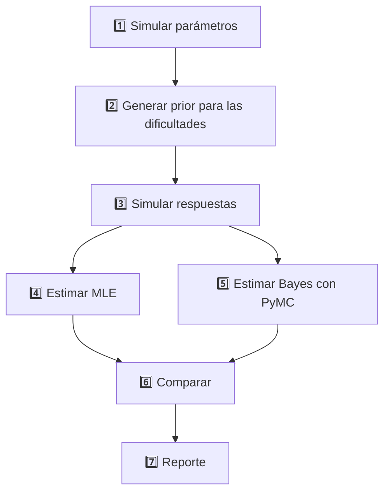

# Simulación y comparación de métodos de estimación 1 PL (MLE vs Bayes con *prior* de dificultad)

## Propósito del proyecto

Analizar empíricamente hasta qué punto un **modelo bayesiano 1 PL** cuya distribución *prior* para la dificultad del ítem proviene de una **predicción externa** (p. ej. `b_pred`) mejora —o no— la precisión de la estimación frente al **método tradicional de Máxima Verosimilitud (MLE)**. Se evalúan distintos escenarios de:

*   **Calidad del *prior*** — tres valores de $R^{2}$: `0.2`, `0.5`, `0.8`.
*   **Tamaño de la sub‑muestra** — fracciones de las 1 000 personas: `0.3`, `0.5`, `0.8`, `1.0`.

El flujo completo se orquesta con **Kedro**; las métricas y artefactos se registran inicialmente en **JSON**.

---

## Metodología resumida



---

## GitHub Pages - Sitio Web del Proyecto

Este proyecto incluye un sitio web completo desplegado en GitHub Pages que presenta:

### 🌐 **[Ver Sitio Web](https://gabrielortegaproyectos.github.io/analisis-calidad-estimacion-1pl-bayesiana/)**

#### Contenido del sitio:
- **Página Principal**: Descripción completa del experimento, metodología y tecnologías
- **Pipeline Interactivo**: Visualización en tiempo real del pipeline con Kedro-Viz
- **Resultados**: Métricas y análisis de comparación entre métodos MLE y Bayesiano

#### Características:
- ✨ Diseño moderno y responsivo con Bootstrap 5
- 📊 Visualización interactiva del pipeline integrada
- 📱 Optimizado para dispositivos móviles
- 🚀 Despliegue automático con GitHub Actions
- 🔄 Actualización automática de visualizaciones cuando se modifica el pipeline

#### Configuración automática (versión ligera):
El workflow `pages.yml` ahora SOLO publica lo que ya exista dentro de `docs/` (no ejecuta Kedro ni instala dependencias). Por lo tanto:
1. Un push a `main` que cambie algo dentro de `docs/` despliega directamente.
2. No se reconstruye automáticamente la visualización del pipeline.

### ¿Cómo actualizar la visualización del pipeline ahora?
Cuando cambies el pipeline y quieras refrescar `docs/pipeline_visualization`:

```bash
# 1. Construir la viz localmente
uv run kedro viz build --include-hooks
# (o: kedro viz build --include-hooks si tu entorno ya está activado)

# 2. Reemplazar carpeta en docs
rm -rf docs/pipeline_visualization
cp -r build docs/pipeline_visualization

# 3. Commit & push
git add docs/pipeline_visualization
git commit -m "docs: actualiza visualización del pipeline"
git push origin main
```
Eso disparará el deploy estático sin volver a correr el pipeline en CI.

### Workflow opcional para ejecutar el pipeline
Sigue existiendo (o puedes mantener) un workflow separado (`kedro-pipeline.yml`) que corre el pipeline y guarda artefactos, pero ya NO interviene en el deploy de Pages.

---

## (Referencia histórica) Ejemplo de workflow de ejecución del pipeline

```yaml
name: Run Kedro Pipeline
on:
  push:
    branches: [ dev ]
    paths:
      - 'src/**'
      - 'conf/**'
      - 'pyproject.toml'
      - 'requirements.txt'
  pull_request:
    branches: [ main, dev ]
  workflow_dispatch:
```

---

## Métricas y reporte de resultados

### Fase 1 – JSON

*   Cada corrida genera `metrics_{r2}_{sample}.json` con:
    *   `rmse_mle`, `rmse_bayes`, `corr_mle`, `corr_bayes`, tiempos de cómputo…
*   Un nodo final agrega un resumen `latest_metrics.json` que puede ser mostrado en GitHub Pages.

---

## Cómo contribuir

1.  Crea un *fork* y genera una rama `feature/<nombre>`.
2.  Sigue la guía de commits convencionales (`feat: …`, `fix: …`, `docs: …`).
3.  Abre un Pull Request a `dev`; requiere pasar CI.

---

© 2025 – Proyecto de investigación IRT 1 PL • Licencia MIT
