# Simulación y comparación de métodos de estimación 1 PL (MLE vs Bayes con *prior* de dificultad)

## Propósito del proyecto

Analizar empíricamente hasta qué punto un **modelo bayesiano 1 PL** cuya distribución *prior* para la dificultad del ítem proviene de una **predicción externa** (p. ej. `b_pred`) mejora —o no— la precisión de la estimación frente al **método tradicional de Máxima Verosimilitud (MLE)**. Se evalúan distintos escenarios de:

*   **Calidad del *prior*** — tres valores de \$R^{2}\$: `0.2`, `0.5`, `0.8`.
*   **Tamaño de la sub‑muestra** — fracciones de las 1 000 personas: `0.3`, `0.5`, `0.8`, `1.0`.

El flujo completo se orquesta con **Kedro**; las métricas y artefactos se registran inicialmente en **JSON**.

---

## Metodología resumida

```mermaid
graph TD
    A[1️⃣ Simular parámetros] --> B[2️⃣ Generar prior para las dificultades]
    B --> C[3️⃣ Simular respuestas]
    C --> D[4️⃣ Estimar MLE]
    C --> E[5️⃣ Estimar Bayes con PyMC]
    D --> F[6️⃣ Comparar]
    E --> F
    F --> G[7️⃣ Reporte]
```



---

## GitHub Pages - Sitio Web del Proyecto

Este proyecto incluye un sitio web completo desplegado en GitHub Pages que presenta:

### 🌐 **[Ver Sitio Web](https://gabrielortegaproyectos.github.io/analisis-calidad-estimacion-1pl-bayesiana/)**

#### Contenido del sitio:
- **Página Principal**: Descripción completa del experimento, metodología y tecnologías
- **Pipeline Interactivo**: Visualización en tiempo real del pipeline con Kedro-Viz
- **Resultados**: Métricas y análisis de comparación entre métodos MLE y Bayesiano

#### Características:
- ✨ Diseño moderno y responsivo con Bootstrap 5
- 📊 Visualización interactiva del pipeline integrada
- 📱 Optimizado para dispositivos móviles
- 🚀 Despliegue automático con GitHub Actions
- 🔄 Actualización automática de visualizaciones cuando se modifica el pipeline

#### Configuración automática:
El sitio se actualiza automáticamente cuando:
1. Se hace push a la rama `main`
2. Se ejecuta el pipeline y cambia la visualización
3. Se modifica cualquier archivo en `/docs`

---

## Configuración de GitHub Actions

### 1 · `kedro-run.yml`

Ejecuta el pipeline en cada *push* a `dev` / `main` y sube artefactos.

```yaml
name: kedro-run
on:
  push:
    branches: [ dev, main ]
jobs:
  run-pipeline:
    runs-on: ubuntu-latest
    steps:
    - uses: actions/checkout@v4
    - uses: actions/setup-python@v5
      with:
        python-version: '3.11'
    - run: pip install poetry && poetry install --no-interaction
    - name: Ejecutar Kedro
      run: poetry run kedro run
    - name: Guardar artefactos de métricas
      uses: actions/upload-artifact@v4
      with:
        name: metrics-reports
        path: data/08_reporting/
```

---

## Métricas y reporte de resultados

### Fase 1 – JSON

*   Cada corrida genera `metrics_{r2}_{sample}.json` con:
    *   `rmse_mle`, `rmse_bayes`, `corr_mle`, `corr_bayes`, tiempos de cómputo…
*   Un nodo final agrega un resumen `latest_metrics.json` que puede ser mostrado en GitHub Pages.

---

## Cómo contribuir

1.  Crea un *fork* y genera una rama `feature/<nombre>`.
2.  Sigue la guía de commits convencionales (`feat: …`, `fix: …`, `docs: …`).
3.  Abre un Pull Request a `dev`; requiere pasar CI.

---

© 2025 – Proyecto de investigación IRT 1 PL • Licencia MIT
